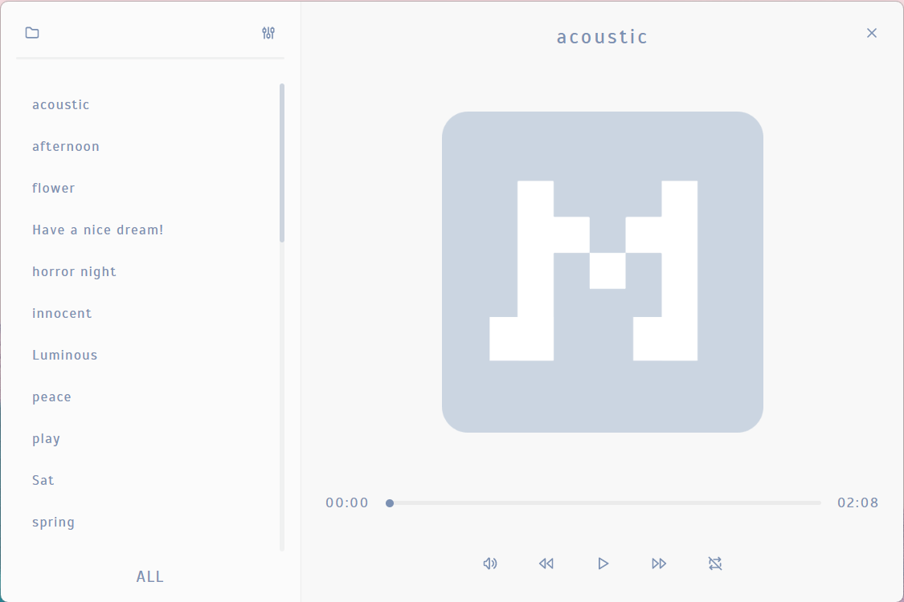
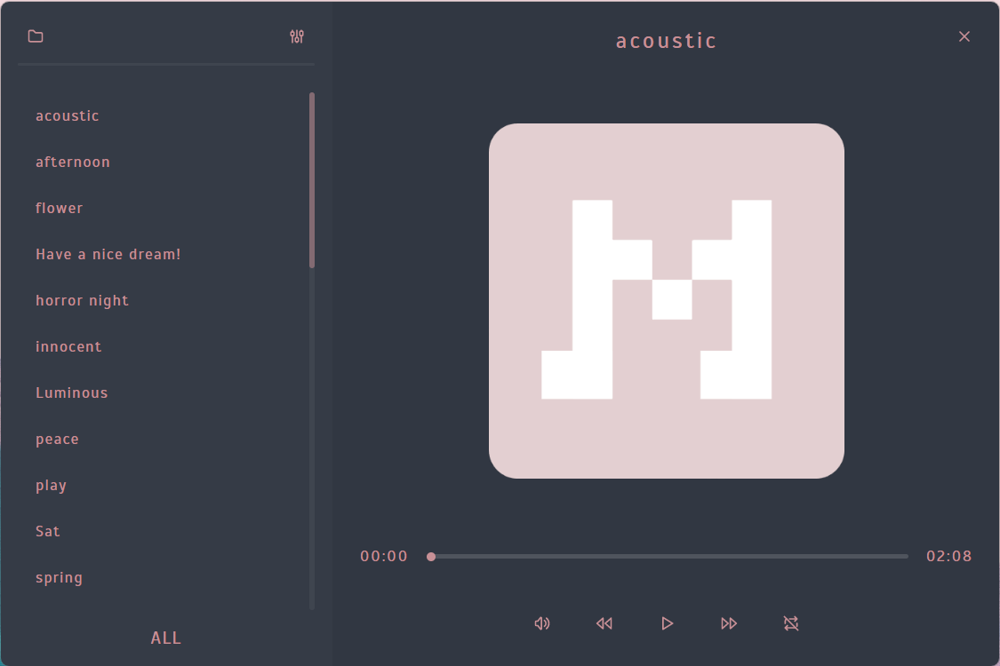

<div align="center" id="top">
  

  &#xa0;

  <!-- <a href="https://muser.netlify.app">Demo</a> -->
</div>

<h1 align="center">Muser</h1>

<p align="center">
  

  

  

  

  <!--  -->

  <!--  -->

  <!--  -->
</p>

<!-- Status -->

<!-- <h4 align="center">
 🚧  Muser 🚀 Under construction...  🚧
</h4> -->

<hr>

<p align="center">
  <a href="#frame_with_picture-screenshots">Screenshots</a> &#xa0; | &#xa0;
  <a href="#dart-about">About</a> &#xa0; | &#xa0;
  <a href="#rocket-technologies">Technologies</a> &#xa0; | &#xa0;
  <a href="#white_check_mark-requirements">Requirements</a> &#xa0; | &#xa0;
  <a href="#checkered_flag-starting">Starting</a> &#xa0; | &#xa0;
  <a href="#memo-license">License</a> &#xa0; | &#xa0;
  <a href="https://github.com/Myoschen" target="_blank">Author</a>
</p>

<br>

## :camera: Screenshots ##

### :sunny: Light mode ###



### :crescent_moon: Dark mode ###



## :dart: About ##

A Simple Music Player.

## :rocket: Technologies ##

The following tools were used in this project:

- [TypeScript](https://www.typescriptlang.org/)
- [Node.js](https://nodejs.org/en/)
- [React](https://reactjs.org/)
- [React Redux](https://react-redux.js.org/)
- [Redux Toolkit](https://redux-toolkit.js.org/)
- [electron-vite](https://evite.netlify.app/)
- [@master/css](https://css.master.co/)

## :white_check_mark: Requirements ##

Before starting :checkered_flag:, you need to have [Git](https://git-scm.com) and [Node](https://nodejs.org/en/) installed.

## :checkered_flag: Starting ##

```bash
# Clone this project
$ git clone https://github.com/Myoschen/muser

# Access
$ cd muser

# Install dependencies
$ pnpm

# Run the project
$ pnpm dev
```

## :memo: License ##

This project is under license from MIT. For more details, see the [LICENSE](LICENSE) file.

Made with :heart: by <a href="https://github.com/Myoschen" target="_blank">Myos</a>

&#xa0;

<a href="#top">Back to top</a>
